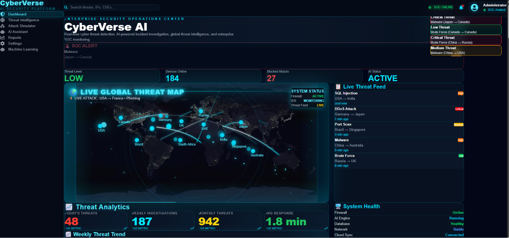
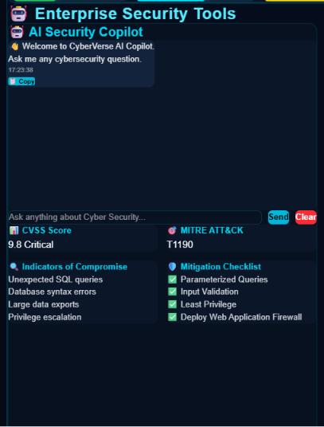
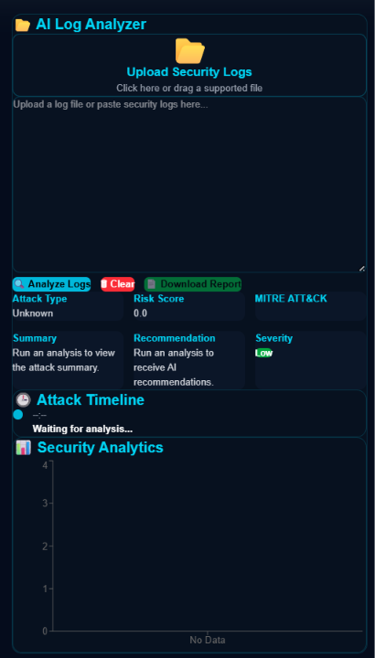
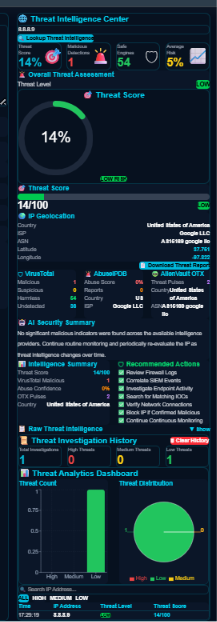
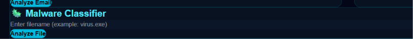
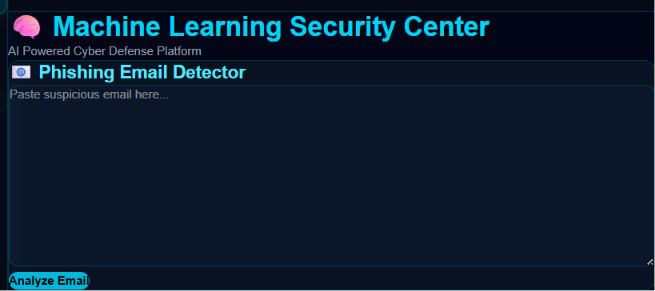
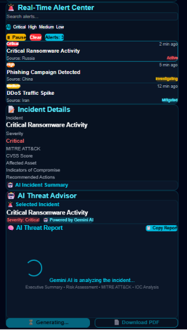

<h1 align="center">🛡️ CyberVerse-AI</h1>

<p align="center">
  <b>AI-Powered Cyber Threat Detection & Security Analysis Platform</b>
</p>

<p align="center">
  A modern cybersecurity platform that uses Artificial Intelligence to detect threats, analyze logs, classify malware, identify phishing attempts, and generate intelligent security reports.
</p>

---

## 🚀 Overview

CyberVerse-AI is an intelligent cybersecurity platform designed to help security analysts and organizations detect, analyze, and respond to cyber threats efficiently.

The application combines AI-powered analysis, threat intelligence, security visualization, and automated reporting into one interactive dashboard.

---

# ✨ Features

### 🛡 Threat Detection
- Detect suspicious cyber activities
- Analyze attack patterns
- Security event monitoring

### 📄 Log Analyzer
- Upload security logs
- AI-powered log analysis
- Identify suspicious events
- Generate insights

### 🎣 Phishing Detection
- Detect phishing URLs
- Analyze suspicious messages
- Risk assessment

### 🦠 Malware Classification
- Malware analysis
- Threat categorization
- AI-assisted predictions

### 🌐 Threat Intelligence
- CVE lookup
- IOC extraction
- Security intelligence dashboard

### 🤖 AI Copilot
- AI-powered cybersecurity assistant
- Explain attacks
- Security recommendations
- Incident guidance

### 📊 Dashboard
- Interactive analytics
- Threat statistics
- Security monitoring

### 📑 Report Generation
- AI-generated incident reports
- PDF export support

---

# 🏗️ System Modules

- Dashboard
- AI Copilot
- Threat Intelligence Center
- Log Analyzer
- Malware Classifier
- Phishing Detector
- Intrusion Detection
- CVE Search
- IOC Extractor
- Attack Simulator
- Incident Report Generator

---

# 🛠️ Tech Stack

## Frontend

- React
- TypeScript
- Vite

## AI

- Google Gemini AI

## Styling

- Tailwind CSS

## Development Tools

- npm
- Git
- GitHub

---

# 📂 Project Structure

```text
CyberVerse-AI/
│
├── src/
│   ├── components/
│   ├── pages/
│   ├── services/
│   ├── utils/
│   └── assets/
│
├── public/
│
├── package.json
├── vite.config.ts
├── tsconfig.json
├── README.md
└── LICENSE
```

---

# ⚙️ Installation

Clone the repository

```bash
git clone https://github.com/YOUR_USERNAME/CyberVerse-AI.git
```

Move into the project

```bash
cd CyberVerse-AI
```

Install dependencies

```bash
npm install
```

Run the development server

```bash
npm run dev
```

---

# 💻 Usage

1. Start the application.
2. Open the dashboard.
3. Navigate to any AI module.
4. Upload logs or interact with the AI assistant.
5. Analyze threats and generate reports.

---

# 📸 Screenshots

## 🏠 Dashboard

<p align="center">
  
</p>

---

## 🤖 AI Copilot

<p align="center">
  
</p>

---

## 📄 Log Analyzer

<p align="center">
  
</p>

---

## 🌐 Threat Intelligence

<p align="center">
  
</p>

---

## 🦠 Malware Classifier

<p align="center">
  
</p>

---

## 🎣 Phishing Detector

<p align="center">
  
</p>

---

## 📑 Incident Report

<p align="center">
  
</p>
---

# 🎯 Future Improvements

- User authentication
- Cloud deployment
- Real-time threat monitoring
- SIEM integration
- Multi-language support
- Dark/Light themes
- Threat history database
- AI model improvements

---

# 🤝 Contributing

Contributions are welcome.

1. Fork the repository.
2. Create a new feature branch.
3. Commit your changes.
4. Open a Pull Request.

---

# 📄 License

This project is licensed under the **MIT License**.

---

# 👨‍💻 Author

**Dhenesh**

AI & Machine Learning Student

GitHub:
https://github.com/KARRI-NAGA-DHENESH

---

## ⭐ Support

If you like this project, consider giving it a ⭐ on GitHub.
